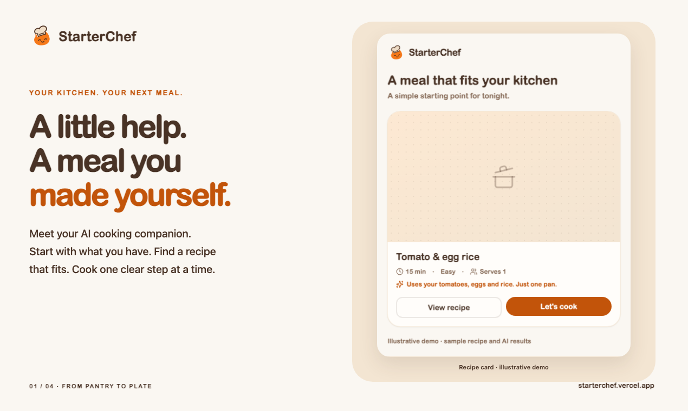
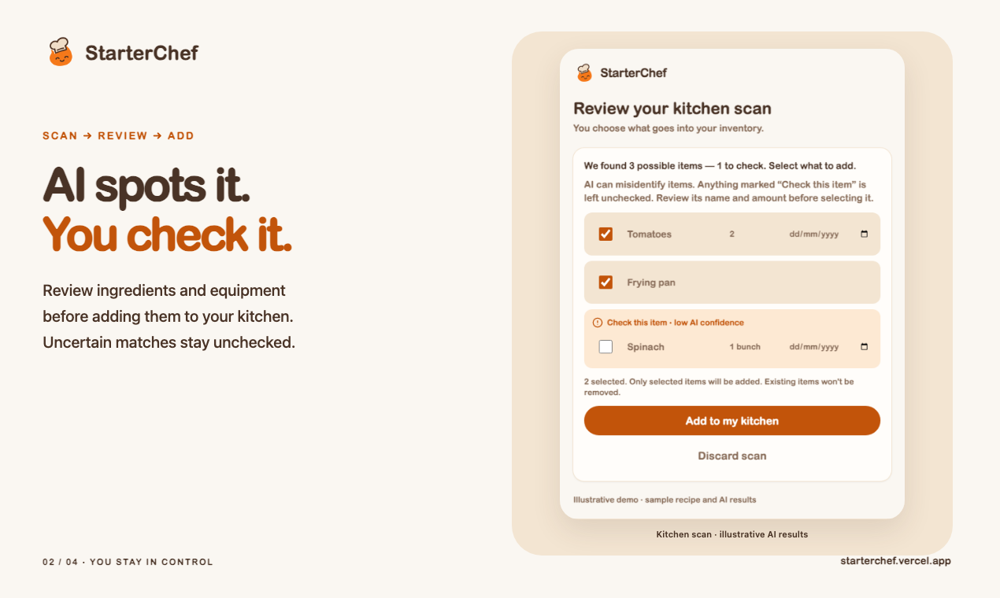
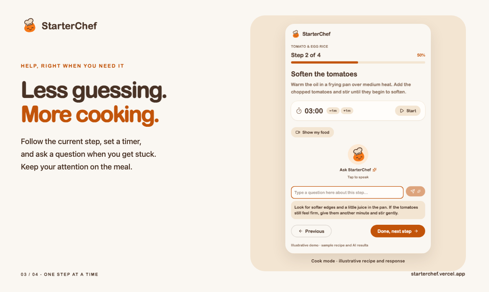
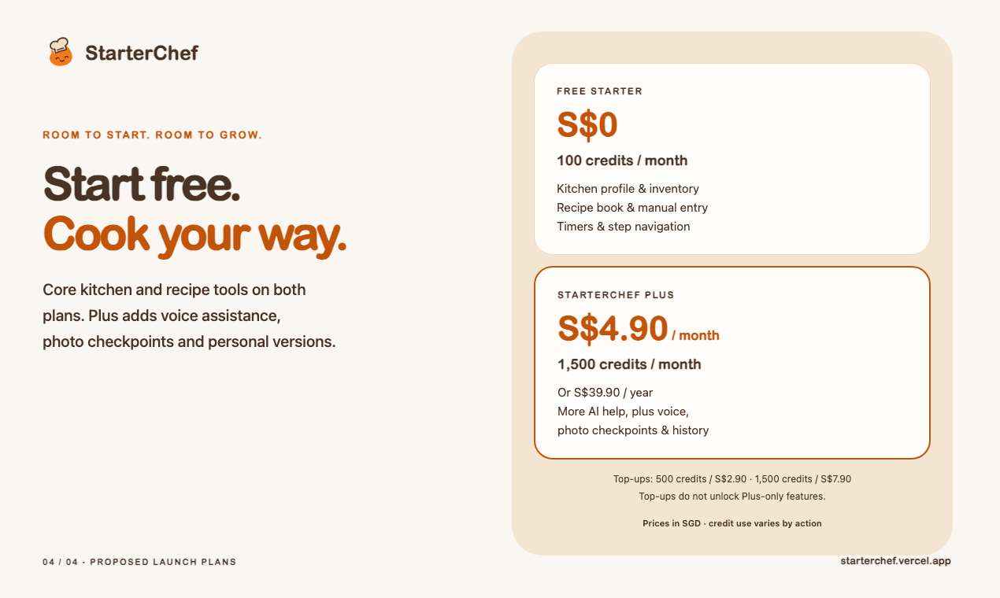

# StarterChef — Product Hunt launch kit

Draft submission materials for M20. No Product Hunt post has been created.

## Submission fields

**Name:** StarterChef

**Website:** https://starterchef.vercel.app/

**Tagline (47 characters):** Your AI cooking companion, from pantry to plate

**Short description (212 characters):**

New to cooking? Scan your ingredients, find recipes that fit your kitchen, and follow one step at a time with AI help. Import recipes you love, ask questions as you cook, and save the changes that worked for you.

Suggested topics: Cooking, Artificial Intelligence, Food & Drink. Select the closest available topics in the submission form. Machine-readable fields are in [submission.json](submission.json).

## Longer description

You have ingredients, a pan, and a saved recipe. Now comes the hard part: deciding what is realistic to cook, understanding each instruction, and knowing what to do when dinner doesn't look like the picture.

StarterChef is a cooking companion for beginners. Scan your kitchen and review the detected ingredients and equipment before adding them to your inventory. Get recipe suggestions that consider your kitchen, dietary preferences, available time, and experience. Bring in recipes from text, photos, or supported links, then adjust them to fit how you cook.

During cooking, follow one step at a time with timers and contextual AI assistance. Ask a question by text or voice, or use a photo checkpoint when you need help interpreting what you see. After the meal, keep the substitutions, notes, and personal recipe versions that worked for you.

The aim is simple: help you finish tonight's meal and make the next one a little easier.

## Maker's first comment

Hi Product Hunt! We're the team behind StarterChef, a cooking companion for people finding their feet in the kitchen.

Our starting point was a familiar gap: having a recipe doesn't always mean knowing how to cook it. You might be missing a tool, cooking for one, or wondering whether “softened” looks anything like the food in your pan. We wanted the help to stay with you from choosing a meal to finishing it.

Here's the flow:

1. Scan your ingredients and equipment, then review what the AI found. Uncertain detections stay unchecked so you decide what to add.
2. Find a recipe that fits your kitchen, or import one you already want to try.
3. Cook one step at a time, using timers, questions, and optional photo checkpoints along the way.
4. Save useful changes and feedback for next time.

We're especially interested in feedback from students, people cooking in small kitchens, and anyone just starting to cook for themselves. The gallery uses sample data to show the experience clearly.

Our proposed launch plans are Free Starter with 100 AI credits per month and StarterChef Plus with 1,500 at S$4.90/month or S$39.90/year. Payments and monthly plan enforcement are still being implemented; these are the intended plans, not a checkout offer today.

What is the moment in a recipe when you most wish someone were beside you? We'd love to hear what would make StarterChef useful in your kitchen.

## Gallery

Upload in this order. Each image is 1270 × 760 pixels. The square thumbnail is 240 × 240 pixels. All exports are below 3 MB.

| Asset                                                    | Caption / alt text                                                                                                                    |
| -------------------------------------------------------- | ------------------------------------------------------------------------------------------------------------------------------------- |
| [Thumbnail](gallery/thumbnail.png)                       | StarterChef's orange flame mascot wearing a chef's hat.                                                                               |
| [01 — Pantry to plate](gallery/01-pantry-to-plate.png)   | StarterChef suggests a simple tomato and egg rice recipe, showing cooking time, servings, and why it fits the sample kitchen.         |
| [02 — Review your scan](gallery/02-review-your-scan.png) | A kitchen scan selects tomatoes and a frying pan. A low-confidence spinach detection is highlighted and remains unchecked for review. |
| [03 — Cook with help](gallery/03-cook-with-help.png)     | Step two of a sample recipe, with a timer, voice control, and a short answer explaining when tomatoes have softened.                  |
| [04 — Launch plans](gallery/04-launch-plans.png)         | Proposed Free Starter and Plus plans: 100 and 1,500 monthly credits, with Plus at S$4.90 monthly or S$39.90 annually.                 |






## Capture provenance and regeneration

These images use the actual `RecipeCard`, `ScanKitchenButton`, `CookAssist`, and `CookStepNavigation` components. Sample props and mocked responses replace database and AI calls. The surrounding recipe/scan headings are a capture composition, not a screenshot of a signed-in production session. Every demo panel is labelled. The recipe's illustration is the app's existing fallback, not a food photograph. No real user data, API keys, or private kitchen photos are included.

The `landing-desktop.png` and `landing-mobile.png` captures render the actual marketing page/layout in the same harness. The separate `landing-production-desktop.png`, `landing-production-mobile.png`, and `opengraph.png` are captured from the built Next.js server. Gallery pricing comes directly from `PLANS` and `TOP_UPS`. The harness adapts Next navigation and image handling and disables analytics; it does not test auth, backend persistence, or model accuracy. It is under `scripts/`, with no public app route or authentication bypass.

After `npm ci` and installing Chromium with `npx playwright install chromium`, run:

```bash
node scripts/product-hunt/capture.mjs
```

The command generates the gallery, six raw [screenshots](screenshots/), and [verification.json](verification.json). It also checks scan selection/save behaviour, empty and uncertain scans, failed-save recovery, mobile overflow, pricing text, and browser errors. Build prerequisites are the repo's locked esbuild, PostCSS/Tailwind and Playwright dependencies. It needs a local HTTP listener and permission to launch Chromium, but no Supabase or AI credentials.

To verify the production page and refresh its separate captures, run `npm run build`, then `npm run start -- --hostname 127.0.0.1 --port 3100` in one terminal and `node scripts/product-hunt/verify-site.mjs` in another. The [built-site report](site-verification.json) records metadata, social image, sitemap/robots, mobile layout, and runtime checks.

## Submission notes

- The materials satisfy the simulated launch brief. A real launch still needs the maker accounts and launch date selected by the team, plus a production smoke test with a test account.
- The pricing table describes approved launch intent. Payment integration, a monthly credit ledger, Free-tier caps, and priority-processing enforcement are not completed by this frontend task. The launch copy explicitly says so.
- No user-count claims, testimonials, safety guarantees, or claims of unlimited voice usage are included. The optional GIF/video has not been produced; the static gallery is complete.
- Product Hunt's [launch guide](https://www.producthunt.com/launch/preparing-for-launch) recommends a 60-character tagline, a square 240 × 240 thumbnail and 1270 × 760 gallery images. It currently lists a 500-character description, while the [posting help page](https://help.producthunt.com/en/articles/479557-how-to-post-a-product) lists 260. This description fits both. Specifications checked on 24 September 2026.
